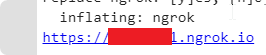
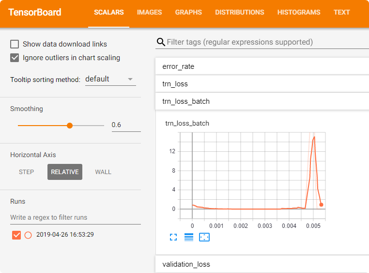
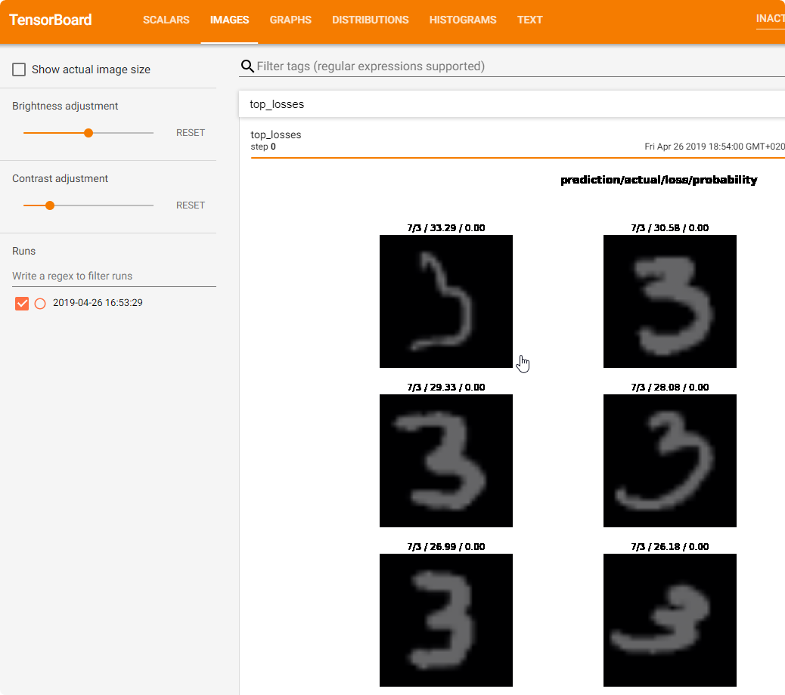
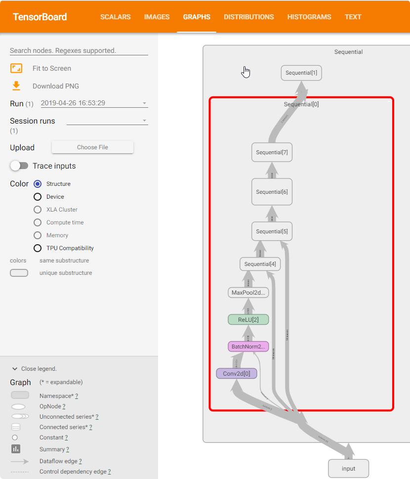
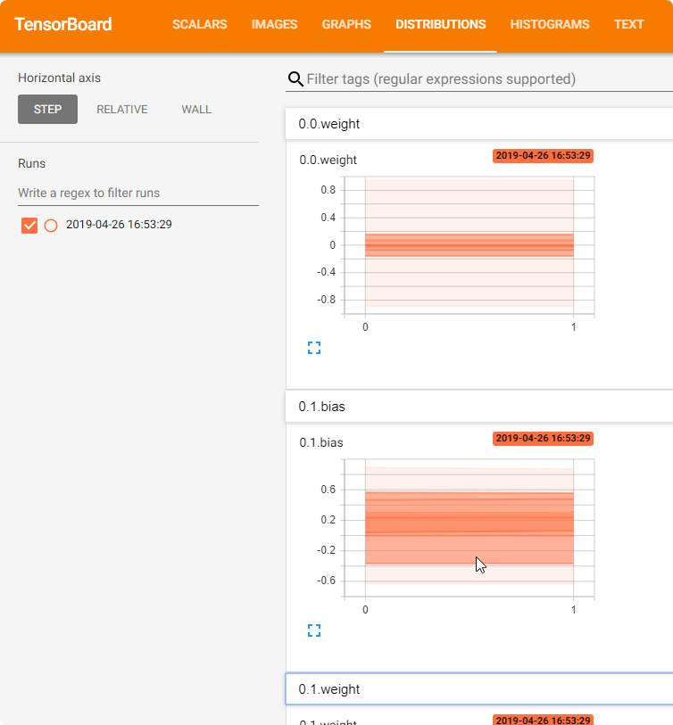
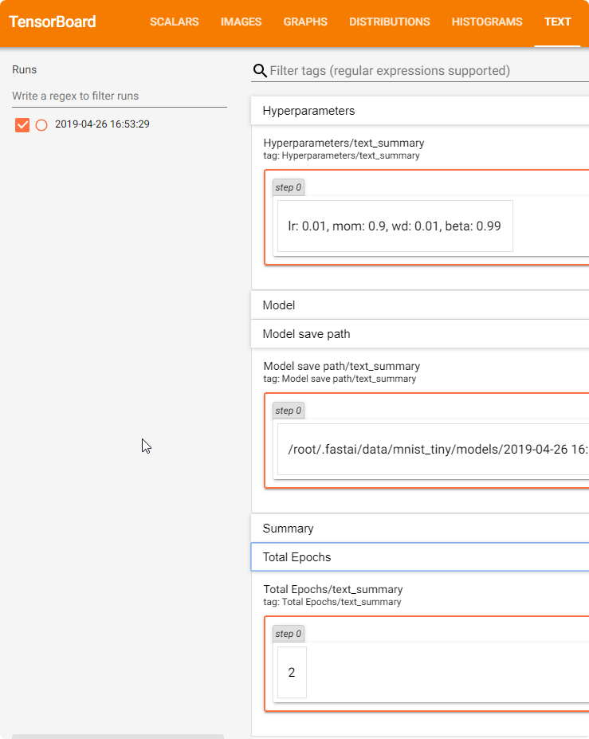
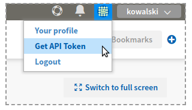
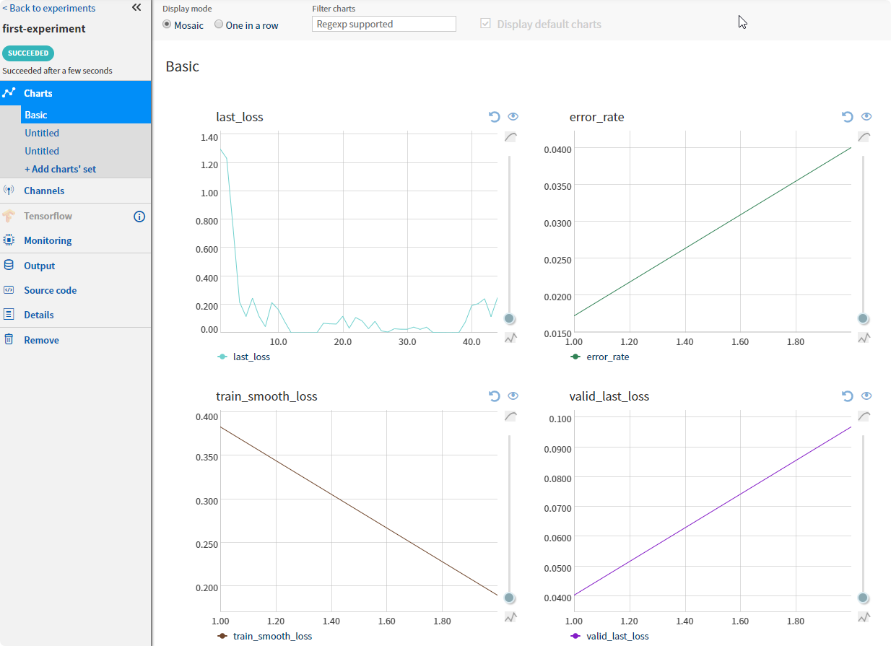
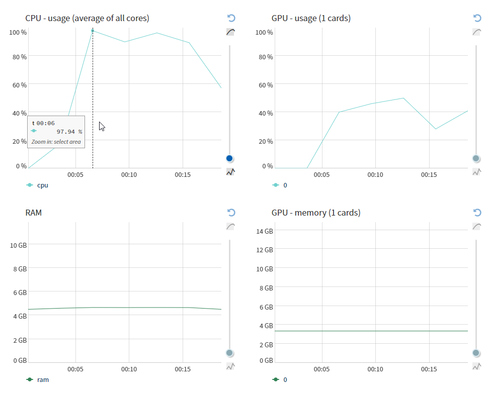
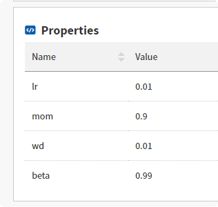

# FastaiMonitor
Simple two Monitors for fast.ai, using TensorBoard or Neptune.ml

`Colab Example:` https://colab.research.google.com/drive/1HEVbnOyKSLSIkMhpYLWO83Wut3hJrP42

# How to use with TensorBoard

List of saved parameters:

* `Scalars `with all metrics and training loss for each batch
* `Images` for top losses images
* `Graph` for the model
* `Distribution` and `Histograms` for each parameters in layers
* `Hyperparameter Text` for `learning rate (lr)`, `momentum (mom)`, `weight decay (wd)`, and `beta (beta)`
* `Text` for `Model`, `Summary`, `Model save path`, and `Total Epochs`

### Google Colab Install

1. Clone project

```python
git clone https://github.com/alexiej/FastaiMonitor.git
```

2. Install all requirements, and run `ngrok.io` to use tensorboard

```python
!pip install tensorboardX
!wget https://bin.equinox.io/c/4VmDzA7iaHb/ngrok-stable-linux-amd64.zip
!unzip ngrok-stable-linux-amd64.zip

LOG_DIR = '/content/log'
get_ipython().system_raw(
    'tensorboard --logdir {} --host 0.0.0.0 --port 6006 &'
    .format(LOG_DIR)
)

get_ipython().system_raw('/content/ngrok http 6006 &')
! curl -s http://localhost:4040/api/tunnels | python3 -c \
    "import sys, json; print(json.load(sys.stdin)['tunnels'][0]['public_url'])"
#End Google Colabc
```

### Local install

1. install tensorboardX, and clone repository

```
pip install tensorboardX
git clone https://github.com/alexiej/FastaiMonitor.git
```

2. run tensorboard

`tensorboard --logdir ./log --host 0.0.0.0 --port 6006 &`

### Run Code

1. Add monitor for your learning fast.ai model


```python
from fastai import *
from fastai.vision import *
from FastaiMonitor.TensorBoardMonitor import TensorBoardMonitor

path = untar_data(URLs.MNIST_TINY);
bs = 64
data = ImageDataBunch.from_folder(path,
                                   ds_tfms=get_transforms(), 
                                   size=224, 
                                   bs=bs
                                  ).normalize(imagenet_stats)
learn = cnn_learner(data, models.resnet34, metrics=error_rate)
TensorBoardMonitor(learn)

learn.fit_one_cycle(2, max_lr=1e-2)
```

4. Go to the tensorboard `http://localhost:6006/` (or to link for `ngrok.io` )
















# How to use with Neptune.ml

List of exported parameters:

* all `metrics`
* `last_loss` batch
* `model.txt` - info about the model
* `opt.txt` - OptiWrapper
* `Properties` for `learning rate (lr)`, `momentum (mom)`, `weight decay (wd)`, and `beta (beta)`
* Use of `CPU/GPU`, `RAM` 

1. Create your account on the Neptune.ml (<https://neptune.ml/>), and get your API Token, and project name



2. Clone git project

```python
git clone https://github.com/alexiej/FastaiMonitor.git
```

2. Install `neptune-client`

```python
pip install neptune-client
```

3. Use NeptuneMonitor with your fast.ai code

```python
API_TOKEN = '---'
PROJECT_NAME = '---'

from fastai import *
from fastai.vision import *
from FastaiMonitor.NeptuneMonitor import NeptuneMonitor

path = untar_data(URLs.MNIST_TINY);
bs = 64
data = ImageDataBunch.from_folder(path,
                                   ds_tfms=get_transforms(), 
                                   size=224, 
                                   bs=bs
                                  ).normalize(imagenet_stats)
learn = cnn_learner(data, models.resnet34, metrics=error_rate)

nm = NeptuneMonitor(learn,
                    api_token=API_TOKEN,
                    project=PROJECT_NAME)
nm.start(name='first-experiment')
learn.fit_one_cycle(2, max_lr=1e-2)

nm.stop()
```

4. Go to the list of the experiments and watch your experiments.





